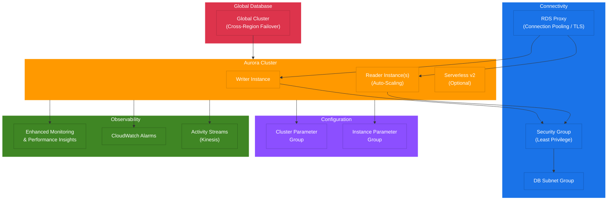

# terraform-aws-rds-aurora

Production-grade Terraform module for deploying AWS Aurora clusters with support for MySQL and PostgreSQL engines, global databases, RDS Proxy, Activity Streams, and automated failover.

## Architecture

```
                            +---------------------------+
                            |     Global Database       |
                            |  (cross-region failover)  |
                            +---------------------------+
                               /                    \
                    Primary Region              Secondary Region
                         |                           |
                  +------+------+             +------+------+
                  |  RDS Proxy  |             | Aurora      |
                  |  (TLS/IAM)  |             | Cluster     |
                  +------+------+             +-------------+
                         |
              +----------+----------+
              |    Aurora Cluster    |
              +---------------------+
              | Writer  | Reader(s) |
              +---------+-----------+
                    |         |
              +-----+---------+-----+
              | Security Group      |
              | (least privilege)   |
              +---------------------+
                         |
              +----------+----------+
              |  Enhanced Monitoring |
              |  CloudWatch Alarms  |
              |  Activity Streams   |
              +---------------------+
```

### Component Diagram



## Features

- **Multi-Engine Support**: Aurora MySQL and Aurora PostgreSQL
- **Global Database**: Cross-region replication with automated failover
- **RDS Proxy**: Connection pooling with TLS enforcement and read-only endpoints
- **Activity Streams**: Real-time database activity monitoring via Kinesis
- **Auto-Scaling**: Automatic read replica scaling based on CPU utilization
- **Serverless**: Support for Aurora Serverless with scaling configuration
- **Security**: Encryption at rest (KMS), encryption in transit (TLS), IAM authentication, Secrets Manager integration
- **Monitoring**: Enhanced monitoring, Performance Insights, CloudWatch alarms (CPU, connections, replication lag)
- **High Availability**: Multi-AZ deployment with configurable promotion tiers
- **Parameter Groups**: Custom cluster and instance parameter groups

## Usage

### Basic Aurora PostgreSQL

```hcl
module "aurora" {
  source = "kogunlowo123/rds-aurora/aws"

  cluster_identifier = "my-aurora-cluster"
  engine             = "aurora-postgresql"
  engine_version     = "15.4"

  master_username             = "dbadmin"
  manage_master_user_password = true
  database_name               = "myapp"

  vpc_id     = "vpc-0123456789abcdef0"
  subnet_ids = ["subnet-aaa", "subnet-bbb", "subnet-ccc"]

  instance_count = 2
  instance_class = "db.r6g.large"

  tags = {
    Environment = "production"
  }
}
```

### Aurora MySQL with RDS Proxy

```hcl
module "aurora" {
  source = "kogunlowo123/rds-aurora/aws"

  cluster_identifier = "my-mysql-cluster"
  engine             = "aurora-mysql"
  engine_version     = "8.0.mysql_aurora.3.05.2"

  master_username             = "dbadmin"
  manage_master_user_password = true
  database_name               = "myapp"

  vpc_id                     = "vpc-0123456789abcdef0"
  subnet_ids                 = ["subnet-aaa", "subnet-bbb"]
  allowed_security_group_ids = [aws_security_group.app.id]

  instance_count = 3
  instance_class = "db.r6g.xlarge"

  enable_rds_proxy  = true
  proxy_require_tls = true

  autoscaling_enabled      = true
  autoscaling_min_capacity = 2
  autoscaling_max_capacity = 8

  tags = {
    Environment = "production"
  }
}
```

### Enterprise with Global Database

```hcl
module "aurora" {
  source = "kogunlowo123/rds-aurora/aws"

  cluster_identifier = "enterprise-aurora"
  engine             = "aurora-postgresql"
  engine_version     = "15.4"

  master_username             = "dbadmin"
  manage_master_user_password = true

  vpc_id     = "vpc-0123456789abcdef0"
  subnet_ids = ["subnet-aaa", "subnet-bbb", "subnet-ccc"]

  instance_count = 3
  instance_class = "db.r6g.2xlarge"

  storage_encrypted = true
  kms_key_arn       = aws_kms_key.aurora.arn

  enable_global_cluster     = true
  global_cluster_identifier = "my-global-db"

  enable_rds_proxy       = true
  enable_activity_stream = true
  activity_stream_mode   = "async"

  backup_retention_period = 35

  tags = {
    Environment = "production"
    Compliance  = "soc2"
  }
}
```

## Security

### Encryption at Rest

All Aurora clusters created by this module have storage encryption enabled by default (`storage_encrypted = true`). You can provide a customer-managed KMS key via `kms_key_arn` for additional control over key rotation and access policies.

### Encryption in Transit

- **RDS Proxy**: TLS is enforced by default (`proxy_require_tls = true`)
- **Aurora Cluster**: SSL/TLS connections are supported natively; enforce via parameter group settings
- **Activity Streams**: Data is encrypted using the provided KMS key

### IAM Authentication

IAM database authentication is enabled by default (`iam_database_authentication_enabled = true`), allowing you to authenticate using IAM roles instead of passwords.

### Secrets Manager Integration

When `manage_master_user_password = true` (default), the master password is automatically managed by AWS Secrets Manager with automatic rotation.

### Security Groups

The module creates a dedicated security group with least-privilege access:
- Ingress limited to specified security groups and/or CIDR blocks
- Database port only (3306 for MySQL, 5432 for PostgreSQL)

## Inputs

| Name | Description | Type | Default | Required |
|------|-------------|------|---------|----------|
| cluster_identifier | The identifier for the Aurora cluster | `string` | - | yes |
| engine | Aurora engine type (aurora-mysql or aurora-postgresql) | `string` | - | yes |
| engine_version | Engine version | `string` | - | yes |
| engine_mode | Engine mode (provisioned or serverless) | `string` | `"provisioned"` | no |
| master_username | Master database username | `string` | - | yes |
| manage_master_user_password | Manage password with Secrets Manager | `bool` | `true` | no |
| master_password | Master password (if not using Secrets Manager) | `string` | `null` | no |
| database_name | Name of the default database | `string` | `null` | no |
| port | Database port | `number` | `null` | no |
| vpc_id | VPC ID | `string` | - | yes |
| subnet_ids | List of subnet IDs (minimum 2) | `list(string)` | - | yes |
| allowed_security_group_ids | Security groups allowed to connect | `list(string)` | `[]` | no |
| allowed_cidr_blocks | CIDR blocks allowed to connect | `list(string)` | `[]` | no |
| instance_count | Number of cluster instances | `number` | `2` | no |
| instance_class | Instance class | `string` | `"db.r6g.large"` | no |
| storage_encrypted | Enable storage encryption | `bool` | `true` | no |
| kms_key_arn | KMS key ARN for encryption | `string` | `null` | no |
| backup_retention_period | Backup retention in days (1-35) | `number` | `7` | no |
| preferred_backup_window | Daily backup window (UTC) | `string` | `"03:00-04:00"` | no |
| preferred_maintenance_window | Weekly maintenance window (UTC) | `string` | `"sun:05:00-sun:06:00"` | no |
| enable_deletion_protection | Enable deletion protection | `bool` | `true` | no |
| skip_final_snapshot | Skip final snapshot on deletion | `bool` | `false` | no |
| iam_database_authentication_enabled | Enable IAM auth | `bool` | `true` | no |
| enable_performance_insights | Enable Performance Insights | `bool` | `true` | no |
| performance_insights_retention_period | PI retention in days | `number` | `7` | no |
| enable_enhanced_monitoring | Enable enhanced monitoring | `bool` | `true` | no |
| monitoring_interval | Monitoring interval in seconds | `number` | `60` | no |
| auto_minor_version_upgrade | Enable auto minor version upgrades | `bool` | `true` | no |
| enabled_cloudwatch_logs_exports | Log types to export | `list(string)` | `[]` | no |
| enable_global_cluster | Enable global database | `bool` | `false` | no |
| global_cluster_identifier | Global cluster identifier | `string` | `null` | no |
| enable_rds_proxy | Enable RDS Proxy | `bool` | `false` | no |
| proxy_idle_client_timeout | Proxy idle timeout in seconds | `number` | `1800` | no |
| proxy_require_tls | Require TLS for proxy connections | `bool` | `true` | no |
| enable_activity_stream | Enable Activity Streams | `bool` | `false` | no |
| activity_stream_mode | Activity stream mode (sync/async) | `string` | `"async"` | no |
| scaling_configuration | Serverless scaling config | `object` | `null` | no |
| autoscaling_enabled | Enable read replica auto-scaling | `bool` | `false` | no |
| autoscaling_min_capacity | Min read replicas for auto-scaling | `number` | `1` | no |
| autoscaling_max_capacity | Max read replicas for auto-scaling | `number` | `5` | no |
| autoscaling_target_cpu | Target CPU for auto-scaling | `number` | `70` | no |
| tags | Tags for all resources | `map(string)` | `{}` | no |

## Outputs

| Name | Description |
|------|-------------|
| cluster_id | Aurora cluster identifier |
| cluster_arn | Aurora cluster ARN |
| cluster_endpoint | Cluster writer endpoint |
| reader_endpoint | Cluster reader endpoint |
| cluster_port | Cluster port |
| instance_ids | List of instance identifiers |
| instance_arns | List of instance ARNs |
| instance_endpoints | List of instance endpoints |
| proxy_endpoint | RDS Proxy endpoint |
| proxy_arn | RDS Proxy ARN |
| proxy_read_only_endpoint | RDS Proxy read-only endpoint |
| global_cluster_id | Global cluster identifier |
| global_cluster_arn | Global cluster ARN |
| security_group_id | Security group ID |
| security_group_arn | Security group ARN |
| enhanced_monitoring_role_arn | Enhanced monitoring IAM role ARN |
| activity_stream_kinesis_stream_name | Kinesis stream for activity |
| db_subnet_group_name | DB subnet group name |
| cluster_parameter_group_name | Cluster parameter group name |
| instance_parameter_group_name | Instance parameter group name |

## Cost Estimation

| Component | Approximate Monthly Cost |
|-----------|-------------------------|
| db.r6g.large (2 instances) | ~$400 |
| db.r6g.xlarge (3 instances) | ~$1,200 |
| db.r6g.2xlarge (3 instances) | ~$2,400 |
| RDS Proxy | ~$150 |
| Activity Streams | ~$50 |
| Performance Insights (7 days) | Free |
| Performance Insights (31 days) | ~$25/instance |
| Enhanced Monitoring | Included |
| Global database replication | ~$200 |

Costs vary by region. Use the [AWS Pricing Calculator](https://calculator.aws.amazon.com/) for accurate estimates.

## Examples

- [Basic Aurora PostgreSQL](examples/basic/) - Simple two-instance cluster
- [Advanced Aurora MySQL with RDS Proxy](examples/advanced/) - Production setup with proxy and auto-scaling
- [Complete Enterprise](examples/complete/) - Full deployment with global database, activity streams, and monitoring

## Requirements

| Name | Version |
|------|---------|
| terraform | >= 1.5.0 |
| aws | >= 5.20.0 |

## References

- [Amazon Aurora Documentation](https://docs.aws.amazon.com/AmazonRDS/latest/AuroraUserGuide/)
- [Aurora Global Database](https://docs.aws.amazon.com/AmazonRDS/latest/AuroraUserGuide/aurora-global-database.html)
- [RDS Proxy](https://docs.aws.amazon.com/AmazonRDS/latest/AuroraUserGuide/rds-proxy.html)
- [Database Activity Streams](https://docs.aws.amazon.com/AmazonRDS/latest/AuroraUserGuide/DBActivityStreams.html)
- [Terraform AWS Provider - RDS Cluster](https://registry.terraform.io/providers/hashicorp/aws/latest/docs/resources/rds_cluster)

## License

MIT License. See [LICENSE](LICENSE) for details.
